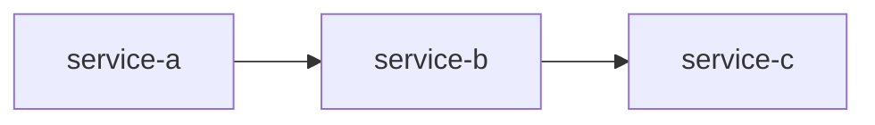
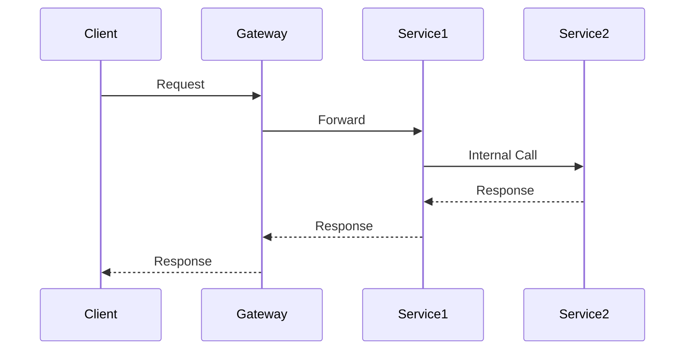

# 📐 아키텍처 설계 템플릿

## 문서 정보

| 항목 | 내용 |
| ---- | ---- |
| 제목 | [기능명] |
| 작성자 | TPM AI / [엔지니어명] |
| 작성일 | YYYY-MM-DD |
| 상태 | Draft / Review / Approved |
| 관련 티켓 | [JIRA-XXX] |

---

## 1. 개요

### 1.1 배경

[왜 이 기능이 필요한지 설명]

### 1.2 목표

[이 기능이 달성하고자 하는 목표]

### 1.3 범위

**포함**:

- [포함 항목 1]
- [포함 항목 2]

**제외**:

- [제외 항목 1]
- [제외 항목 2]

---

## 2. 영향도 분석

### 2.1 영향받는 서비스

| 서비스 | 영향도 | 변경 유형 | 설명 |
| ------ | ------ | --------- | ---- |
| rider-service | 높음/중간/낮음 | 기능추가/수정/인터페이스 | [설명] |
| delivery-service | | | |
| order-service | | | |
| notification-service | | | |

### 2.2 의존성 그래프



### 2.3 위험 요소

| 위험 | 영향 | 확률 | 대응 방안 |
| ---- | ---- | ---- | --------- |
| [위험1] | 높음/중간/낮음 | 높음/중간/낮음 | [대응방안] |

---

## 3. 아키텍처 설계

### 3.1 시스템 다이어그램

```text
[시스템 다이어그램]
```

### 3.2 서비스별 설계

#### rider-service

**책임**: [이 기능에서의 책임]

**변경 사항**:

- [변경1]
- [변경2]

**새로운 API**:

| Method | Endpoint | 설명 |
| ------ | -------- | ---- |
| POST | /api/v1/xxx | [설명] |

**새로운 이벤트**:

| 이벤트 | 토픽 | 페이로드 |
| ------ | ---- | -------- |
| XxxEvent | xxx.topic | { field1, field2 } |

#### delivery-service

[동일 형식으로 작성]

---

## 4. 데이터 설계

### 4.1 도메인 모델

```kotlin
// 새로운/변경된 도메인 모델
data class NewEntity(
    val id: Long,
    val field1: String,
    // ...
)
```

### 4.2 데이터베이스 스키마

```sql
-- 새로운/변경된 테이블
CREATE TABLE new_table (
    id BIGSERIAL PRIMARY KEY,
    field1 VARCHAR(255) NOT NULL,
    created_at TIMESTAMP NOT NULL DEFAULT CURRENT_TIMESTAMP
);
```

### 4.3 ERD

```text
[ERD 다이어그램]
```

---

## 5. 시퀀스 다이어그램

### 5.1 메인 플로우



### 5.2 에러 플로우

```mermaid
sequenceDiagram
    [에러 시나리오]
```

---

## 6. API 설계

### 6.1 새로운 API

#### POST /api/v1/xxx

**Request**:

```json
{
    "field1": "value1",
    "field2": 123
}
```

**Response (성공)**:

```json
{
    "success": true,
    "data": {
        "id": 1,
        "field1": "value1"
    }
}
```

**Response (실패)**:

```json
{
    "success": false,
    "error": {
        "code": "XXX_001",
        "message": "Error message"
    }
}
```

---

## 7. 이벤트 설계

### 7.1 발행 이벤트

| 이벤트명 | 토픽 | 발행 시점 |
| -------- | ---- | --------- |
| XxxCreated | xxx.created | [시점] |

**페이로드 예시**:

```json
{
    "eventId": "uuid",
    "eventType": "XxxCreated",
    "timestamp": "2024-01-01T00:00:00Z",
    "payload": {
        "id": 1,
        "field1": "value1"
    }
}
```

### 7.2 구독 이벤트

| 이벤트명 | 발행 서비스 | 처리 내용 |
| -------- | ----------- | --------- |
| YyyEvent | other-service | [처리 내용] |

---

## 8. 배포 계획

### 8.1 배포 순서

| 순서 | 서비스 | 배포 내용 | 롤백 가능 |
| ---- | ------ | --------- | --------- |
| 1 | rider-service | [내용] | Yes/No |
| 2 | delivery-service | [내용] | Yes/No |

### 8.2 마이그레이션

```sql
-- 마이그레이션 스크립트
```

### 8.3 롤백 계획

[롤백 시 필요한 작업]

---

## 9. 테스트 계획

### 9.1 단위 테스트

| 테스트 케이스 | 담당 서비스 |
| ------------- | ----------- |
| [케이스1] | rider-service |

### 9.2 통합 테스트

| 테스트 시나리오 | 관련 서비스 |
| --------------- | ----------- |
| [시나리오1] | rider, delivery |

### 9.3 성능 테스트

| 테스트 항목 | 목표 수치 |
| ----------- | --------- |
| API 응답시간 | < 200ms |
| 처리량 | > 1000 TPS |

---

## 10. 검토 요청 사항

- [ ] 이 데이터는 정말 이 MSA가 관리해야 할까요?
- [ ] MSA 간 호출 순서가 적절한가요?
- [ ] 클린 아키텍처 관점에서 책임 분배가 올바른가요?
- [ ] 성능/확장성 관점에서 문제가 없을까요?
- [ ] [추가 검토 사항]

---

## 변경 이력

| 버전 | 날짜 | 작성자 | 변경 내용 |
| ---- | ---- | ------ | --------- |
| 0.1 | YYYY-MM-DD | TPM AI | 초안 작성 |
| 0.2 | YYYY-MM-DD | [이름] | 팀 검토 반영 |
